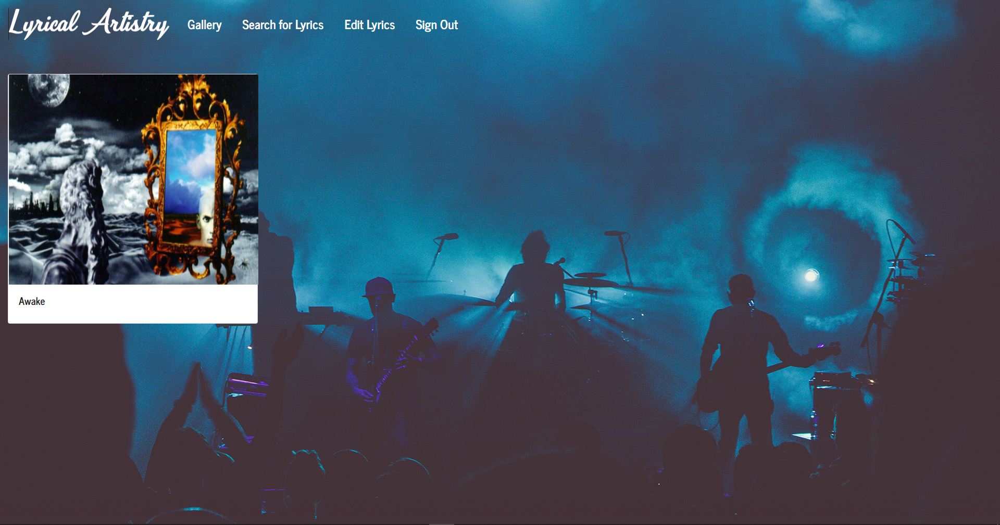
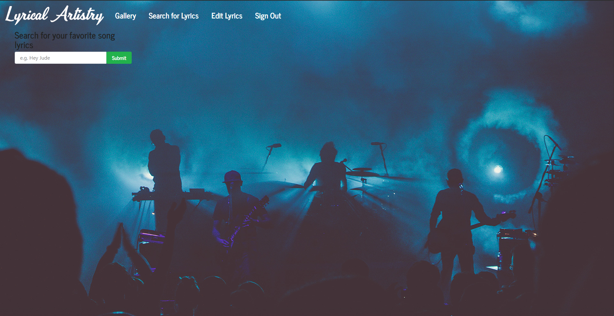

# Lyrical Artistry

* [Description](#work)
* [Install](#install)
* [Credits](#credits)
* [License](#license)

# Deployed App
https://lyrical-artistry.herokuapp.com/

## Description
Lyrical Artistry allows users to create simple art images to save to their gallery. They can edit the image numerous ways such as searching up their favorite lyrics from a song and then save it to their image. 

## Purpose
Today, one of the most popular forms of interaction on social media are through memes, Snapchats, or TikTok videos. The common theme around them are that they are very short in length (an instant snapshot or a short video less than a few seconds). This app aims to help create these type of content for users by allowing them to take pictures and edit them like memes.  

## Instructions
Search for a song and select the lyrics you would like to use. Then display those lyrics over a image you choose and edit the text. After your image is done, save that image to your gallery.  

## Technologies
Javascript, MongoDB, React, AWS S3, Axios, KanvasConva, MusixMatch API, HTML, CSS

## Credits
- Elijah Davis (back-end)
- Brandon Craig (back-end)
- Eric Chen (full-stack)
    - Gateway routes to and from MongoDB
    - Designed quote search up page and used musicMatch API
    - Incorporated user authentication
- Anzel Capparelli (full-stack)

## License 
[Link to MIT License](https://opensource.org/licenses/MIT) <br>
MIT License

      Copyright (c) 2021 [Eric Chen]
      
      Permission is hereby granted, free of charge, to any person obtaining a copy
      of this software and associated documentation files (the "Software"), to deal
      in the Software without restriction, including without limitation the rights
      to use, copy, modify, merge, publish, distribute, sublicense, and/or sell
      copies of the Software, and to permit persons to whom the Software is
      furnished to do so, subject to the following conditions:
      
      The above copyright notice and this permission notice shall be included in all
      copies or substantial portions of the Software.
      
      THE SOFTWARE IS PROVIDED "AS IS", WITHOUT WARRANTY OF ANY KIND, EXPRESS OR
      IMPLIED, INCLUDING BUT NOT LIMITED TO THE WARRANTIES OF MERCHANTABILITY,
      FITNESS FOR A PARTICULAR PURPOSE AND NONINFRINGEMENT. IN NO EVENT SHALL THE
      AUTHORS OR COPYRIGHT HOLDERS BE LIABLE FOR ANY CLAIM, DAMAGES OR OTHER
      LIABILITY, WHETHER IN AN ACTION OF CONTRACT, TORT OR OTHERWISE, ARISING FROM,
      OUT OF OR IN CONNECTION WITH THE SOFTWARE OR THE USE OR OTHER DEALINGS IN THE
      SOFTWARE.

## Reporting issues and making contributions 
Report issues at https://github.com/bcraig-13/lyrical-artistry/issues

## Contact
* Github : ElijahIG
* Github : bcraig-13
* Github : EricChen96       Email : ericchen201896@gmail.com     
* Github : anzelcapparelli

# Images of Deployed App





# Install

Add a .env to the `/server` folder of this app.

Then inside of the .env add a SERVER_SECRET set to any value you'd like

```
SERVER_SECRET = 112345
MUSIXMATCH_KEY= GET MUSIXMATCH SERVER API KEY
```

First off make sure you have a local version of MongoDB running on your machine. This project will make a local database for you called `appDB`. (You may want to rename the local database to something else.)

Start by installing front and backend dependencies. Go to the root directory, server directory, and client directory, and run the following command each time:

```
npm install
```

After all installations complete, return to the root directory and run the following command in your terminal:

```
npm start
```

That's it, your app should be running on <http://localhost:3000>. The Express server should intercept any AJAX requests from the client.